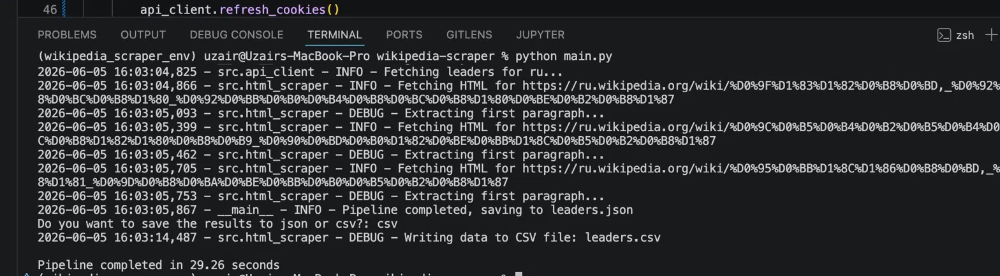
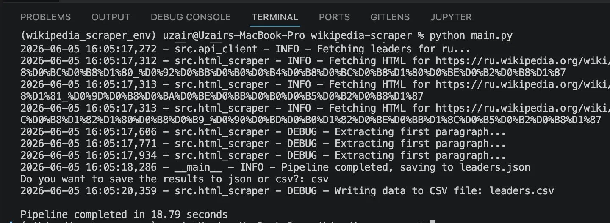
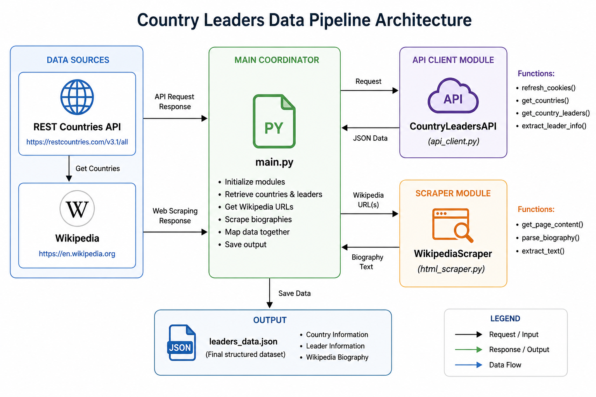

# 🌍 Wikipedia Country Leaders Scraper

[](https://www.python.org/)


## 📖 Description

A Python pipeline that pulls world leaders from a REST API, scrapes their Wikipedia biographies, cleans the text, and saves everything into a structured JSON file.

The scraper handles multiple languages (English, French, Dutch, Arabic, Russian) and automatically cleans up pronunciation markers, IPA symbols, references, and other Wikipedia noise so the output is clean and human-readable.

---

## 📦 Repo Structure

```
.
├── src/
│   ├── __init__.py
│   ├── api_client.py       # Handles all calls to the country-leaders API
│   ├── html_scraper.py     # Fetches and parses Wikipedia pages
│   └── logger.py           # Centralized logging setup
├── .gitignore
├── leaders.json            # Output file generated after running the script
├── main.py                 # Entry point — coordinates the full pipeline
├── requirements.txt
└── README.md
```

---

## ⚙️ Installation

1. Clone the repository:
   ```bash
   git clone https://github.com/UzairSaeedKhan/wikipedia-scraper.git
   cd wikipedia-scraper
   ```

2. Create and activate a virtual environment:
   ```bash
   python3 -m venv wikipedia_scraper_env
   source wikipedia_scraper_env/bin/activate  # on Windows: wikipedia_scraper_env\Scripts\activate
   ```

3. Install dependencies:
   ```bash
   pip install -r requirements.txt
   ```

---

## 🛎️ Usage

Run the pipeline with:

```bash
python3 main.py
```

The script will:
- Refresh the API session cookie automatically
- Fetch the list of available countries
- Retrieve all leaders per country
- Scrape and clean each leader's Wikipedia first paragraph in parallel
- Prompt you to choose between saving the output as `leaders.json` or `leaders.csv`

---

## ✨ Features

### ⚡ Parallel Scraping with ThreadPoolExecutor

Wikipedia pages are scraped using Python's `concurrent.futures.ThreadPoolExecutor` with 10 parallel workers, meaning all leaders per country are fetched simultaneously instead of one by one.

The difference is significant:

| Mode | Time |
|------|------|
| Sequential (no threads) | ~29 seconds |
| Parallel (ThreadPoolExecutor) | ~18 seconds |

**Sequential run — 29.26 seconds:**



**Parallel run — 18.79 seconds:**



---

### 💾 Output Format Choice

Once the pipeline finishes, you are prompted to choose your preferred output format:

```
Do you want to save the results to json or csv?:
```

Type `json` to save as `leaders.json` or `csv` to save as `leaders.csv` — the file is generated accordingly.

---

## 🖼️ Visuals

**Pipeline flow:**



**Sample output in `leaders.json`:**

```json
{
    "us": [
        {
            "first_name": "Barack",
            "last_name": "Obama",
            "wikipedia_bio": "Barack Hussein Obama II (born August 4, 1961) is an American politician who served as the 44th president of the United States from 2009 to 2017."
        }
    ]
}
```

---

## 🧰 Tech Stack

| Tool | Purpose |
|------|---------|
| `requests` | HTTP requests and session management |
| `BeautifulSoup` | HTML parsing |
| `re` | Text cleaning with regex |
| `json` | Saving output data |
| `csv` | Saving output as CSV |
| `concurrent.futures` | Parallel scraping with ThreadPoolExecutor |
| `logging` | Runtime tracking and warnings |

---

## ⏱️ Timeline

Completed in **3 days** as part of the AI Bootcamp at [BeCode.org](https://becode.org/).

---

## 👤 Contributors

**Uzair Saeed Khan**  
Connect on [LinkedIn](https://www.linkedin.com/in/uzairsaeedkhan/) · [GitHub](https://github.com/UzairSaeedKhan)
